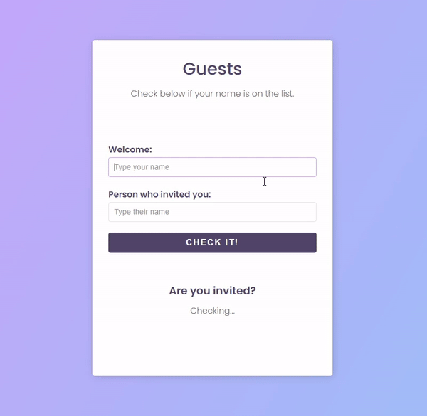

# Guests List

Check out who is invited to my party and who's not! 😎

## Table of Contents
- <a href="#description">Description</a>
- <a href="#tools-used">Tools Used</a>
- <a href="#layout-preview">Layout Preview</a>
- <a href="#usage-instructions">Usage Instructions</a>
- <a href="#deployment">Deployment</a>
- <a href="#contact">Contact</a>

## Description

This is a simple form made to see whether the user is included in the guests list or not. It was made using HTML, CSS and a little bit of JS, using only a simple function. 

## Tools Used 

- <a href="https://developer.mozilla.org/pt-BR/docs/Web/HTML" target="_blank">HTML5</a>
- <a href="https://developer.mozilla.org/pt-BR/docs/Web/CSS" target="_blank">CSS3</a>

## Layout preview

## Usage Instructions
To use the project locally, follow the instructions below:

- Clone this repository to your local machine.
- Open the **index.html** file in a web browser.
- When testing, those are the only invited names: **maria, guilherme, roger, isabela, ana, tatiane, welton, rafaella, camila, davi, yago, rhyan and messi**.

## Deployment
The project is deployed using GitHub Pages. You can access it by clicking the link below:

<a href="https://wesleysantosdev.github.io/guests-list/" target="_blank">Guests List</a>

## Contact
If you have any suggestions for this project, feel free to contact me:

- Name: Wesley Santos
- Email: wesleysantosdev@outlook.com
- GitHub: @wesleysantosdev

I hope you enjoy this project!
